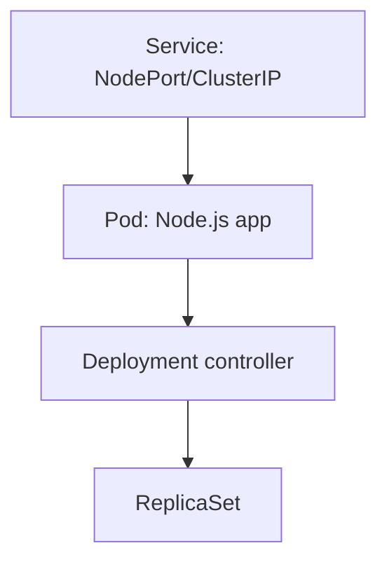

# Architecture

This project demonstrates a simple but realistic CI/CD flow from commit to running workload on Kubernetes.

## CI/CD flow

## Kubernetes resources

## Local networking note (kind)

With kind, the Kubernetes “node” runs as a Docker container. NodePorts may not bind to host `localhost` the way you expect.
For reliable access during demos and CI checks, prefer:

- `kubectl port-forward svc/<service> <local_port>:<service_port>`

See `docs/TROUBLESHOOTING.md`.
